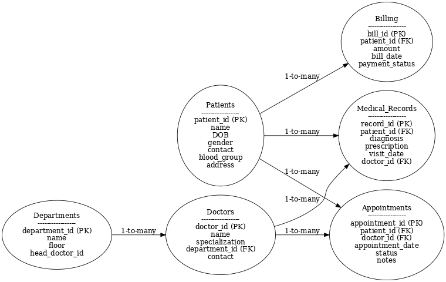

# 🏥 Hospital Patient Management & Analytics System (SQL Project)

## 📌 Overview
This is a complete **SQL database project** simulating a hospital's patient, doctor, billing, and appointment management system.  
It is designed to demonstrate **database design, SQL queries, stored procedures, triggers, and analytics**, making it a strong portfolio project for interviews.

---

## 🚀 Features
- **Database Design**
  - Patients, Doctors, Departments, Appointments, Medical Records, and Billing tables
  - Foreign keys for data integrity
- **Stored Procedure**
  - Auto-generate bills for patients after appointments
- **Triggers**
  - Auto-update payment status when bill amount is zero
- **Views**
  - Daily summary of appointments and revenue
- **Sample Data**
  - Realistic data for patients, doctors, and appointments
- **ER Diagram**
  - Visual representation of the database schema

---

## 📂 Project Structure
| File Name | Description |
|-----------|-------------|
| `Hospital_Project.sql` | Full SQL script (tables, data, procedures, triggers, views, queries) |
| `hospital_er_diagram.png` | ER diagram image |
| `README.md` | Project documentation |

---

## 🖼 ER Diagram


---

## ⚙️ How to Run the Project
1. Install **MySQL Server** and open **MySQL Workbench** (or CLI).
2. Create the database and run the SQL script:
   ```sql
   SOURCE /path/to/Hospital_Project.sql;
   ```
3. Explore the database:
   - List all tables:
     ```sql
     SHOW TABLES;
     ```
   - Run example queries from the script.

---

## 📊 Example Queries
```sql
-- List all pending bills
SELECT * FROM Billing WHERE payment_status = 'Pending';

-- Find all patients treated by a specific doctor in a date range
SELECT p.name, a.appointment_date
FROM Patients p
JOIN Appointments a ON p.patient_id = a.patient_id
WHERE a.doctor_id = 1 
  AND a.appointment_date BETWEEN '2025-08-01' AND '2025-08-31';
```

---

## 🛠 Technologies Used
- **Database:** MySQL
- **Tools:** MySQL Workbench / Command Line
- **Language:** SQL

---

## 📄 License
This project is licensed under the MIT License — you are free to use and modify it.

---

**👤 Author:** *Vinay Tiwari*  
📧 Email: *vt39091@gmail.com*  
🔗 GitHub: https://github.com/Vinaytiwari25  
